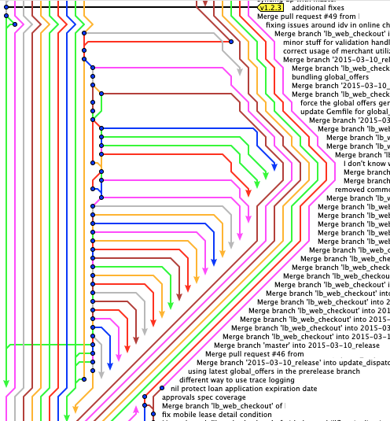
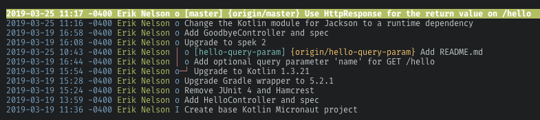
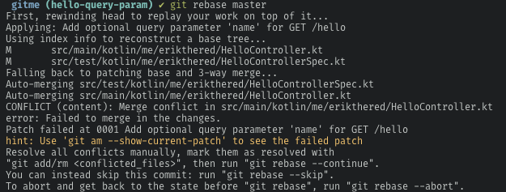
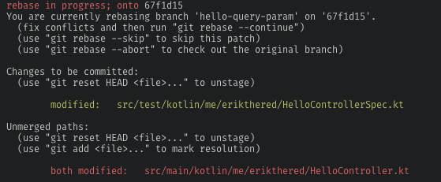
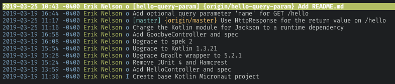
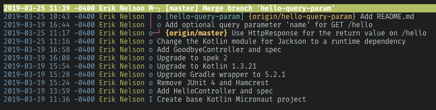

If you're doing software development on a team, it's very likely that you're using git for version control. One common problem I've seen is that it's quite easy to end up with a messy history full of useless (and sometimes confusing) merge commits.

Working solo with a git project, it's pretty simple to develop something with a linear history that's easy to follow. Once you've got multiple team members working on feature branches concurrently things can get, well... ugly:

Usually this is caused by an excessive amount of merge commits. Unfortunately, GitHub encourages behaviors that lead to problems like this. You've probably seen this button before:

If you click this, GitHub will merge master into your feature branch resulting in a merge commit. When you ultimately merge the feature branch you'll end up with 2 merge commits:

1. master -> feature branch
2. feature branch -> master

This might seem ok since it marks when you synchronized your branch with the latest changes in master, but your repository's history will quickly become polluted with merge commits that have little value. But there's a better way, and it's called [rebasing](https://git-scm.com/docs/git-rebase).

Instead of merging master into the feature branch, we can _rebase_ our feature branch on master. What this means is that we can take our new commits on the branch and move them so they branch off of the HEAD of master rather than where we intially diverged. This makes much more sense if you visualize it. Here is our before state:

Once we have our feature branch checked out we can do the rebase by running `git rebase master`. It's possible to run into a conflict when rebasing, for example when I attempt to rebase onto master I get this output:

There's a lot of information there, it's sometimes easier to run `git status` to see what you need to do:

In this case, the changes to `HelloControllerSpec.kt` were merged automatically, whereas `HelloController.kt` has a conflict that we manually need to resolve. We can fix the conflict and then do a `git add src/main/kotlin/me/erikthered/HelloController.kt` to stage the file. If you run `git status` again, both files should be staged now. The next step is to run `git rebase --continue` which continues to apply the remaining changes. Depending on how much your branch and master have diverged, you may have to fix conflicts several times. In our case though, no further conflicts are encountered and the rebase completes successfully.

Now if we run `tig` we'll see things look slightly different:

Despite being on a separate branch, our history looks linear! This lets us do a fast-forward merge which basically means we won't have a merge commit. One caveat to doing git rebase is that you will need to _force push_ your feature branch up to your remote repo (GitHub, GitLab, etc.), due to rebase causing our commit hashes to change.

GitHub's default merge behavior is to always create a merge commit, so not having one might not fit your current flow. Fortunately, git is very flexible and we can still force a merge commit if we want with `git merge --no-ff`:

I hope this helps you maintain a cleaner git history for your projects.

I'm planning on writing a part 2 to this article going over interactive rebase, keep a look out!
